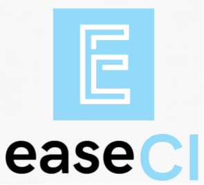

Ease CI core
================

EaseCI is a project that enables rapid deployment of applications in popular technologies. 
A simple interface allows creating complex Delivery Pipeline even for newbies. 
The project is an open source created by people who want to save the suffering associated with deployment.

## Main principles

If you want to develop the EaseCI project, you must follow several community rules:
- the code must be logically divided into packages
- we follow the rules of clean SOLID code etc.
- every interface and base class must be provided with valuable comments
- the project must have high code coverage, unit tests are required for each commit

## Technologies used

In Ease CI you can write in any JVM language. No matter which one.
The only condition is that the application works properly.
 Main:
- Java 11
- Groovy 2.5
- Ratpack 1.8
- Netty 4.1

 Libraries:
- Junit 5
- Mockito 3
- RxJava 3
- Vavr 0.10.2
- Guava 28.1
- Lombok 1.18

## Plugin system

EaseCI core as the name implies only provides an easily expandable core. Plugins for EaseCI can be developed 
in any language that compiles into the jar archive and meets the requirements described in the documentation.

## Run EaseCI core
EaseCI can be run with few ways.
#### Docker (recommended)
- Firstly build your docker image or download one from Docker Hub (available in future) 
<code>docker build --tag easeci:1.0 .</code>
- Run a new container from created image before 
<code>docker run -d --name easeci-core -p 9000:9000 -v /home/${whoami}/easeci:/opt/app/workspace easeci-core:latest <image></code>
- Test application working, check plugin state for example 
<code>curl -X GET localhost:9000/plugin/state</code>
#### Virtual Machine (by Vagrant and Virtualbox)
- You must have installed Vagrant and Virtualbox
- Next clone source code <code>git clone --depth=5 --branch=master https://github.com/easeci/easeci-core.git </code>
- Go to directory with source code where <code>Vagrantfile</code> is placed and type <code>vagrant up</code> in your terminal
#### systemd (directly on your host)
- Clone git repository as it is show above
- Copy <code>easeci.service</code> to <code>/etc/systemd/system</code> in your host
- Start this unit with systemctl <code>systemcrl start easeci</code>
